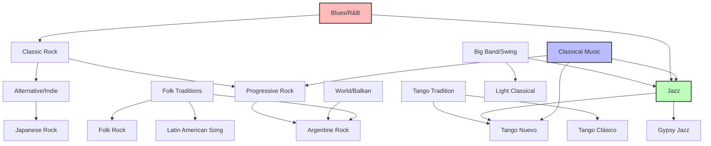

# Musical Preferences by Genre

This document showcases the WERX Hugo theme's capabilities while organizing artists into coherent genre categories. Each grouping reflects both historical context and sonic characteristics.

## Classical Music (Romantic & 20th Century)

Concert music from the Romantic period through modern classical composition, emphasizing emotional expression and technical mastery.

- **Pyotr Ilyich Tchaikovsky** — Russian Romantic composer, ballet and symphony master
- **Sergei Rachmaninoff** — Late Romantic pianist-composer, lush harmonies
- **Dmitri Shostakovich** — Soviet-era modernist, symphonic depth under political pressure



## Progressive & Art Rock

The cerebral branch of rock music, characterized by complex compositions, conceptual albums, and musical experimentation beyond traditional song structures.

- **Pink Floyd** — Pioneers of psychedelic and progressive rock, sonic landscapes
- **Radiohead** — Post-modern prog, electronic experimentation meets guitar rock
- **Emerson, Lake & Palmer** — Virtuoso prog rock with classical influences
- **Queen** — Theatrical rock with progressive and operatic elements
- **David Gilmour** — Pink Floyd guitarist, solo atmospheric rock




## Classic Rock & Blues Rock

The foundation of electric guitar-driven rock, rooted in blues traditions and amplified to arena scale.

- **Led Zeppelin** — Hard rock titans, blues-rock innovators
- **The Rolling Stones** — Blues rock legends, rhythm & blues core
- **AC/DC** — High-voltage hard rock, riff-based simplicity
- **The Doors** — Psychedelic rock with blues and jazz influences
- **The Beatles** — Pop-rock pioneers who defined modern music
- **Ray Charles** — Soul and R&B pioneer, blues and gospel fusion



## Alternative & Indie Rock

Post-punk evolution: tighter song structures, artful production, and garage rock revival aesthetics.

- **Arctic Monkeys** (pre-Body Paint) — British indie rock with sharp lyrics
- **The Strokes** — Garage rock revival, minimalist production
- **The Last Shadow Puppets** — Alex Turner side project, baroque pop
- **Red Hot Chili Peppers** — Funk rock fusion, groove-oriented alternative
- **Mazzy Star** — Dream pop, slowcore aesthetics

## Argentine Rock (Rock Nacional)

Latin American rock tradition, blending international influences with local identity and Spanish-language poetry.

- **Charly García** — Argentine rock legend, progressive and new wave influences
- **Soda Stereo** — New wave pioneers, art rock sophistication
- **Los Piojos** — Rock with punk energy and folk roots
- **Sui Generis** — Early Argentine folk rock, Charly García's first major band
- **Serú Girán** — Progressive rock supergroup, jazz-rock fusion
- **Andrés Calamaro** — Prolific rock singer-songwriter, spans styles
- **Los Fabulosos Cadillacs** — Ska, reggae, and Latin rock fusion

## Electronic & Dance

Synthesizer-driven music focused on rhythm, production, and dancefloor aesthetics.

- **Daft Punk** — French house, electronic pop innovators

## Jazz (Traditional, Bebop & Cool)

American art form emphasizing improvisation, complex harmony, and rhythmic sophistication.

- **Dave Brubeck** — Cool jazz pianist, unusual time signatures
- **Paul Desmond** — Alto saxophonist, Brubeck Quartet member
- **John Coltrane Quartet** — Modal jazz, spiritual jazz explorations
- **Chet Baker** — Cool jazz trumpeter and vocalist
- **Herbie Hancock** — Post-bop and fusion pianist, funk-jazz innovator
- **Fats Waller** — Stride piano, early jazz and swing



## Gypsy Jazz & European Jazz

Django Reinhardt's hot club style and European jazz traditions.

- **Django Reinhardt** — Gypsy jazz guitar pioneer, manouche swing

## Latin American Song & Nueva Canción

Politically conscious folk-influenced music from Latin America, poetry-driven songwriting.

- **Silvio Rodríguez** — Cuban nueva trova, poetic revolutionary song
- **José Larralde** — Argentine folk, working-class social commentary

## World Music & Balkan Brass

Traditional music from global contexts, folk instruments in contemporary settings.

- **Emir Kusturica & The No Smoking Orchestra** — Balkan brass, punk energy with Romani influences
- **Buena Vista Social Club** — Cuban son, traditional Afro-Cuban music revival

## Tango Clásico

Traditional Argentine tango from the golden age, orquestas típicas and the canción porteña.

- **Carlos Gardel** — The voice of tango, foundational repertoire
- **Carlos di Sarli** — Orquesta típica, smooth dance-oriented arrangements
- **Julio Sosa** — "El varón del tango," powerful masculine delivery
- **Alberto Podestá** — Classic tango vocalist
- **Roberto Goyeneche** — "El Polaco," expressive phrasing and rubato
- **Tita Merello** — Tango singer and actress, working-class voice



## Tango Nuevo

Astor Piazzolla's revolutionary fusion: concert tango that broke from dance tradition, incorporating jazz harmony and classical composition.

- **Astor Piazzolla** — Tango nuevo creator, bandoneon virtuoso



## Big Band, Swing & Traditional Pop

Pre-rock popular music: orchestras, crooners, and the swing era.

- **Glenn Miller** — Swing era bandleader, iconic sound of WWII America
- **The Ink Spots** — Vocal harmony group, R&B and doo-wop precursors

## Light Classical & Orchestral Pop

Accessible classical repertoire and orchestrated popular music for broad audiences.

- **Andre Rieu** — Waltz concerts, accessible classical entertainment
- **Johann Strauss** — Viennese waltz tradition
- **Xavier Cugat** — Latin orchestra leader, rumba and mambo
- **Ray Conniff** — Easy listening, choral arrangements of pop standards

## Chanson Française

French vocal tradition emphasizing lyrical storytelling, emotional delivery, and sophisticated melody.

- **Edith Piaf** — Iconic French chanson, dramatic vocal power
- **Charles Aznavour** — Singer-songwriter, poetic chanson tradition

## Folk Rock & Singer-Songwriter

Acoustic-based rock with literary lyrics, 1960s folk revival evolution.

- **Simon & Garfunkel** — Folk rock duo, harmony and poetic songwriting

## Japanese Rock & Alternative

Contemporary Japanese rock spanning indie, math rock, and alternative styles.

- **TK from Ling Tosite Sigure** — Japanese math rock, intricate guitar work
- **boa** — Japanese alternative rock

## Genre Distribution Analysis


{
  "type": "doughnut",
  "data": {
    "labels": [
      "Classical",
      "Progressive/Art Rock",
      "Classic Rock/Blues",
      "Alternative/Indie",
      "Argentine Rock",
      "Electronic",
      "Jazz",
      "Gypsy Jazz",
      "Latin American Song",
      "World/Balkan",
      "Tango Clásico",
      "Tango Nuevo",
      "Big Band/Swing",
      "Light Classical/Orchestral",
      "Chanson Française",
      "Folk Rock",
      "Japanese Rock"
    ],
    "datasets": [{
      "label": "Artists per Genre",
      "data": [3, 5, 6, 5, 7, 1, 6, 1, 2, 2, 6, 1, 2, 4, 2, 1, 2],
      "backgroundColor": [
        "rgba(99, 132, 255, 0.7)",
        "rgba(255, 99, 132, 0.7)",
        "rgba(54, 162, 235, 0.7)",
        "rgba(255, 206, 86, 0.7)",
        "rgba(75, 192, 192, 0.7)",
        "rgba(153, 102, 255, 0.7)",
        "rgba(255, 159, 64, 0.7)",
        "rgba(199, 199, 199, 0.7)",
        "rgba(83, 102, 255, 0.7)",
        "rgba(255, 99, 255, 0.7)",
        "rgba(255, 180, 120, 0.7)",
        "rgba(120, 200, 180, 0.7)",
        "rgba(200, 150, 100, 0.7)",
        "rgba(150, 180, 255, 0.7)",
        "rgba(255, 150, 200, 0.7)",
        "rgba(180, 255, 180, 0.7)",
        "rgba(255, 200, 100, 0.7)"
      ],
      "borderWidth": 2
    }]
  },
  "options": {
    "responsive": true,
    "plugins": {
      "legend": {
        "position": "right"
      },
      "title": {
        "display": true,
        "text": "Music Collection by Genre"
      }
    }
  }
}


## Genre Relationships & Influences



## Interactive Genre Timeline

<div id="timeline-viz"></div>


const data = [
  {genre: "Classical (Romantic/Modern)", start: 1840, end: 1960, y: 50},
  {genre: "Big Band/Swing", start: 1920, end: 1950, y: 100},
  {genre: "Tango Clásico", start: 1920, end: 1960, y: 150},
  {genre: "Gypsy Jazz", start: 1930, end: 1950, y: 200},
  {genre: "Jazz (Bebop/Cool)", start: 1945, end: 1970, y: 250},
  {genre: "Tango Nuevo", start: 1955, end: 1990, y: 300},
  {genre: "Chanson Française", start: 1940, end: 1980, y: 350},
  {genre: "Classic Rock/Blues", start: 1960, end: 1980, y: 400},
  {genre: "Folk Rock", start: 1965, end: 1975, y: 450},
  {genre: "Progressive Rock", start: 1968, end: 1978, y: 500},
  {genre: "Argentine Rock", start: 1970, end: 2010, y: 550},
  {genre: "Latin American Song", start: 1970, end: 2000, y: 600},
  {genre: "Light Classical/Orchestral", start: 1950, end: 2025, y: 650},
  {genre: "Alternative/Indie", start: 1995, end: 2015, y: 700},
  {genre: "Electronic", start: 1995, end: 2015, y: 750},
  {genre: "Japanese Rock", start: 2005, end: 2020, y: 800},
  {genre: "World/Balkan", start: 1990, end: 2010, y: 850}
];

const margin = {top: 20, right: 120, bottom: 60, left: 180};
const width = 800 - margin.left - margin.right;
const height = 950 - margin.top - margin.bottom;

const svg = d3.select("#timeline-viz")
  .append("svg")
  .attr("width", width + margin.left + margin.right)
  .attr("height", height + margin.top + margin.bottom)
  .append("g")
  .attr("transform", `translate(${margin.left},${margin.top})`);

const xScale = d3.scaleLinear()
  .domain([1840, 2025])
  .range([0, width]);

const colorScale = d3.scaleOrdinal()
  .domain(data.map(d => d.genre))
  .range(d3.schemeTableau10.concat(d3.schemePaired));

svg.selectAll(".timeline-bar")
  .data(data)
  .enter()
  .append("rect")
  .attr("class", "timeline-bar")
  .attr("x", d => xScale(d.start))
  .attr("y", d => d.y - 10)
  .attr("width", d => xScale(d.end) - xScale(d.start))
  .attr("height", 20)
  .attr("fill", d => colorScale(d.genre))
  .attr("opacity", 0.7)
  .attr("stroke", "#333")
  .attr("stroke-width", 1);

svg.selectAll(".genre-label")
  .data(data)
  .enter()
  .append("text")
  .attr("class", "genre-label")
  .attr("x", -5)
  .attr("y", d => d.y + 5)
  .attr("text-anchor", "end")
  .style("font-size", "11px")
  .style("font-family", "sans-serif")
  .text(d => d.genre);

const xAxis = d3.axisBottom(xScale)
  .tickFormat(d3.format("d"))
  .ticks(10);

svg.append("g")
  .attr("transform", `translate(0,${height - 20})`)
  .call(xAxis)
  .style("font-size", "12px");

svg.append("text")
  .attr("x", width / 2)
  .attr("y", -5)
  .attr("text-anchor", "middle")
  .style("font-size", "16px")
  .style("font-weight", "bold")
  .text("Genre Timeline: Peak Periods");

const decades = d3.range(1840, 2030, 10);
svg.selectAll(".decade-line")
  .data(decades)
  .enter()
  .append("line")
  .attr("class", "decade-line")
  .attr("x1", d => xScale(d))
  .attr("x2", d => xScale(d))
  .attr("y1", 0)
  .attr("y2", height - 20)
  .attr("stroke", "#ddd")
  .attr("stroke-width", 1)
  .attr("stroke-dasharray", "2,2");


## Artist Count by Era


{
  "type": "bar",
  "data": {
    "labels": ["1840s-1920s", "1920s-1950s", "1960s-1970s", "1980s-1990s", "2000s-2020s"],
    "datasets": [{
      "label": "Active Artists",
      "data": [3, 10, 18, 12, 5],
      "backgroundColor": [
        "rgba(99, 132, 255, 0.6)",
        "rgba(255, 159, 64, 0.6)",
        "rgba(54, 162, 235, 0.6)",
        "rgba(255, 206, 86, 0.6)",
        "rgba(75, 192, 192, 0.6)"
      ],
      "borderColor": [
        "rgba(99, 132, 255, 1)",
        "rgba(255, 159, 64, 1)",
        "rgba(54, 162, 235, 1)",
        "rgba(255, 206, 86, 1)",
        "rgba(75, 192, 192, 1)"
      ],
      "borderWidth": 2
    }]
  },
  "options": {
    "responsive": true,
    "scales": {
      "y": {
        "beginAtZero": true,
        "title": {
          "display": true,
          "text": "Number of Artists"
        }
      }
    },
    "plugins": {
      "legend": {
        "display": false
      },
      "title": {
        "display": true,
        "text": "Artist Activity by Era"
      }
    }
  }
}


## Notes on Genre Classification

**Classical Division:** Focused on Romantic and 20th-century composers rather than Baroque/Classical periods, reflecting the emotional and technical density preferred.

**Jazz Granularity:** Separated traditional stride piano (Fats Waller) from cool jazz (Brubeck, Baker) and post-bop (Coltrane, Hancock); Django gets his own gypsy jazz category due to distinct stylistic lineage.

**Argentine Rock Depth:** Seven acts spanning early folk rock (Sui Generis), progressive fusion (Serú Girán), new wave (Soda Stereo), and ska-rock (Los Fabulosos Cadillacs) demonstrate commitment to this regional tradition.

**Temporal Breadth:** Collection spans 180+ years from Tchaikovsky (1840s) to contemporary Japanese rock, with heaviest concentration in 1960s-1970s rock and jazz.

## Complete Artist Roster

```text
Classical Music (3):
Tchaikovsky, Rachmaninoff, Shostakovich

Progressive & Art Rock (5):
Pink Floyd, Radiohead, Emerson Lake & Palmer, Queen, David Gilmour

Classic Rock & Blues Rock (6):
Led Zeppelin, The Rolling Stones, AC/DC, The Doors, The Beatles, Ray Charles

Alternative & Indie Rock (5):
Arctic Monkeys, The Strokes, The Last Shadow Puppets,
Red Hot Chili Peppers, Mazzy Star

Argentine Rock (7):
Charly García, Soda Stereo, Los Piojos, Sui Generis, Serú Girán,
Andrés Calamaro, Los Fabulosos Cadillacs

Electronic & Dance (1):
Daft Punk

Jazz (Traditional, Bebop, Cool) (6):
Dave Brubeck, Paul Desmond, John Coltrane Quartet, Chet Baker,
Herbie Hancock, Fats Waller

Gypsy Jazz (1):
Django Reinhardt

Latin American Song & Nueva Canción (2):
Silvio Rodríguez, José Larralde

World Music & Balkan Brass (2):
Emir Kusturica & The No Smoking Orchestra, Buena Vista Social Club

Tango Clásico (6):
Carlos Gardel, Carlos di Sarli, Julio Sosa, Alberto Podestá,
Roberto Goyeneche, Tita Merello

Tango Nuevo (1):
Astor Piazzolla

Big Band, Swing & Traditional Pop (2):
Glenn Miller, The Ink Spots

Light Classical & Orchestral Pop (4):
Andre Rieu, Johann Strauss, Xavier Cugat, Ray Conniff

Chanson Française (2):
Edith Piaf, Charles Aznavour

Folk Rock & Singer-Songwriter (1):
Simon & Garfunkel

Japanese Rock & Alternative (2):
TK from Ling Tosite Sigure, boa
```

## WERX Theme Implementation Notes

**Shortcode Usage:**
- `prev` shortcode provides hover previews for external links
- `chart` shortcode renders Chart.js visualizations inline
- `d3js` shortcode enables custom D3.js visualizations
- `mermaid` shortcode creates flow diagrams from text

**Content Organization:**
- Clear heading hierarchy ensures functional TOC navigation
- Genre sections allow anchor links from index pages
- Metadata in frontmatter enables filtering and categorization

**Visual Elements:**
- Doughnut chart shows genre proportions across 17 categories
- Bar chart displays temporal distribution by era
- D3.js timeline provides interactive genre history spanning 1840-2025
- Mermaid diagram maps genre relationships and influences
